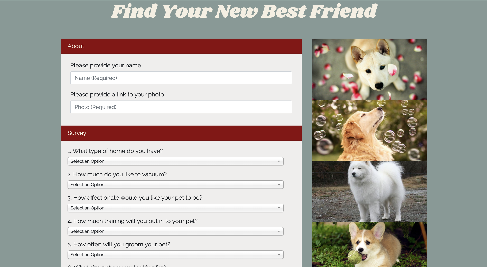
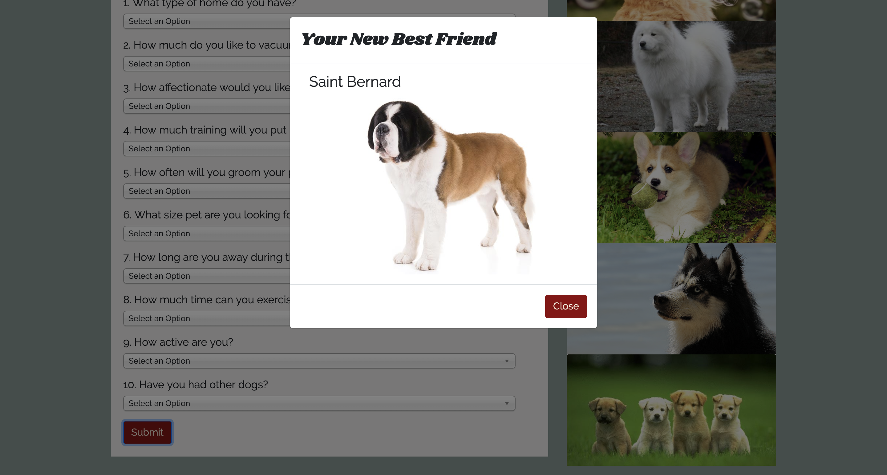
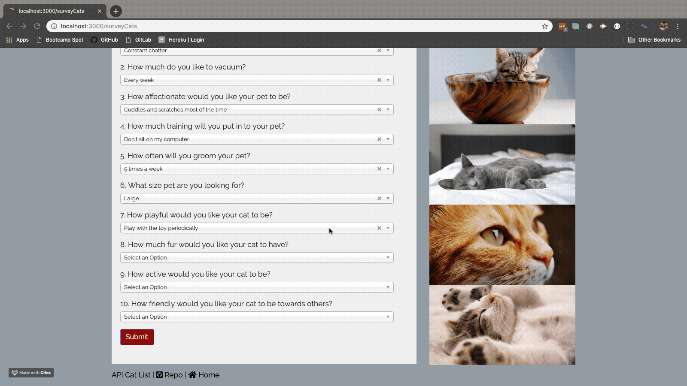

# Pet Finder

A compatibility-based application to help people find their best pet match. By answering 10 questions, users will then be matched to a dog or a cat based on their answer choices.

As this project is still in development, there are currenlty only 10 dog and 10 cat breeds available.

## Website
https://fathomless-taiga-89875.herokuapp.com/

## Homework Instructions
[Homework Details](homework_instructions.md)

## Languages, Tools and Technologies

* HTML 5
* CSS 3
* Bootstrap 4
* Javascript
* jQuery
* Node JS
* Express
* npm Chosen-JS
* npm - Path
* Google Fonts
* Heroku

## How it works

* Users will be asked to choose between a survey built for cats or for dogs.
* Users will answer 10 questions and input their name and a link to their photo.
* The application with then match users with their ideal cat or dog match based on the user's answers.
* The user's data then gets pushed to either the `usersDogs.js` or the `usersCats.js file.`

## Node Modules

* Run npm install in your terminal in the petFinder directory to get all the node modules used for this project.

## Screen Captures and GIF

## Future Developments

* User ability to login and see saved profile
* Ability to favourite images and breed information
* Add more breeds to both cats and dogs
* Give more detailed information about the breed

## External Sources Used

* Trupanion Cat Breed Guide - https://trupanion.com/
* Purina - https://www.purina.com/
* CatTime - https://cattime.com/
* DogTime - https://dogtime.com/
* American Kennel Club - https://www.akc.org/
